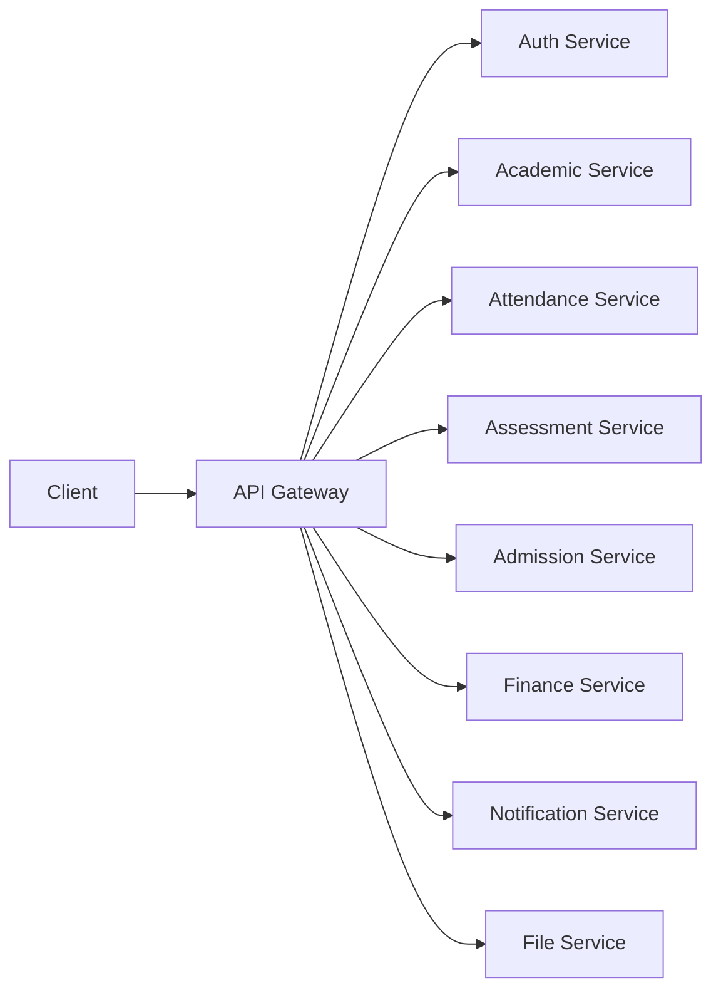

# API Gateway Service

The API Gateway is the single entry point for the Sisfo Akademik backend microservices. It handles routing, load balancing, authentication, rate limiting, and circuit breaking.

## Architecture

The gateway is built using Go's standard `net/http/httputil` ReverseProxy with custom middleware for cross-cutting concerns.



### Key Features

1.  **Reverse Proxy**: Forwards requests to appropriate upstream services based on path prefixes.
2.  **Load Balancing**: Supports Round-Robin load balancing if multiple upstream URLs are provided (comma-separated).
3.  **Circuit Breaker**: Detects failing upstreams and temporarily stops sending traffic to them (Open/Closed states).
4.  **Authentication**: Validates JWT access tokens for protected routes using the shared `middleware.AuthWith`.
5.  **Rate Limiting**: Redis-based rate limiting per IP and specific limits per route prefix.
6.  **CORS**: Handles Cross-Origin Resource Sharing headers.
7.  **Request Logging**: structured logging for all requests.

## Configuration

The gateway is configured via environment variables.

| Variable                        | Description                         | Example                 |
| ------------------------------- | ----------------------------------- | ----------------------- |
| `HTTP_PORT`                     | Port to listen on                   | `8080`                  |
| `ENV`                           | Environment (dev/prod)              | `dev`                   |
| `JWT_ACCESS_SECRET`             | Secret for validating access tokens | `secret`                |
| `REDIS_ADDR`                    | Redis address for rate limiting     | `localhost:6379`        |
| `CORS_ALLOWED_ORIGINS`          | Allowed origins for CORS            | `http://localhost:3000` |
| `APP_UPSTREAM_AUTH_URL`         | Auth Service URL                    | `http://localhost:8081` |
| `APP_UPSTREAM_ACADEMIC_URL`     | Academic Service URL                | `http://localhost:8082` |
| `APP_UPSTREAM_ATTENDANCE_URL`   | Attendance Service URL              | `http://localhost:8083` |
| `APP_UPSTREAM_ASSESSMENT_URL`   | Assessment Service URL              | `http://localhost:8084` |
| `APP_UPSTREAM_ADMISSION_URL`    | Admission Service URL               | `http://localhost:8085` |
| `APP_UPSTREAM_FINANCE_URL`      | Finance Service URL                 | `http://localhost:8086` |
| `APP_UPSTREAM_NOTIFICATION_URL` | Notification Service URL            | `http://localhost:8087` |
| `APP_UPSTREAM_FILE_URL`         | File Service URL                    | `http://localhost:8088` |

**Note**: You can also use `_URLS` suffix (e.g., `APP_UPSTREAM_AUTH_URLS`) to specify multiple comma-separated URLs for load balancing.

## Routes

| Path Prefix              | Target Service       | Auth Required |
| ------------------------ | -------------------- | ------------- |
| `/api/v1/auth/`          | Auth Service         | No            |
| `/api/v1/users/`         | Auth Service         | Yes           |
| `/api/v1/schools/`       | Academic Service     | Yes           |
| `/api/v1/classes/`       | Academic Service     | Yes           |
| `/api/v1/subjects/`      | Academic Service     | Yes           |
| `/api/v1/attendance/`    | Attendance Service   | Yes           |
| `/api/v1/grades/`        | Assessment Service   | Yes           |
| `/api/v1/reports/`       | Assessment Service   | Yes           |
| `/api/v1/admissions/`    | Admission Service    | Yes           |
| `/api/v1/finance/`       | Finance Service      | Yes           |
| `/api/v1/notifications/` | Notification Service | Yes           |
| `/api/v1/files/`         | File Service         | Yes           |

## Health Check

- **Gateway Health**: `GET /api/v1/gateway/health` - Returns the status of the gateway and connectivity to all upstreams.

## Running Locally

```bash
# Run from root
make run-gateway
```
